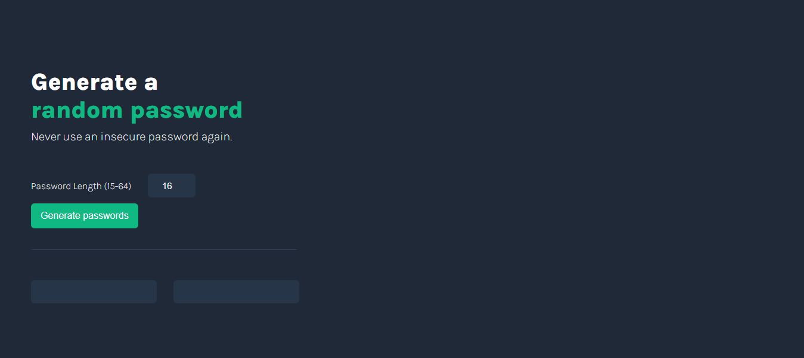

# Random Password Generator

A utility web application that generates secure random passwords. Built as part of Scrimba's JavaScript module solo project.



[Live Demo](https://password-generator-solo-projeck-kain.netlify.app/)

## Features

- Generate two random passwords simultaneously
- Customize password length (15-64 characters)
- Copy passwords to clipboard with a single click
- Visual feedback when password is copied
- Responsive design following Figma specifications

## Password Character Set

The generator includes:
- Uppercase letters (A-Z)
- Lowercase letters (a-z)
- Numbers (0-9)
- Special characters (~\`!@#$%^&*()_-+={}[]|:;<>.?/)

## Technologies Used

- HTML
- CSS
- JavaScript
- Deployed on Netlify

## Project Requirements

### Core Requirements ✅
- Built from scratch
- Generates two random passwords on button click
- Each password can be 15 characters long

### Stretch Goals Achieved ✅
- Configurable password length
- Copy-on-click functionality with visual feedback

## Setup

1. Clone the repository
```bash
git clone https://github.com/Elikyals/password-generator.git
```

2. Open `index.html` in your browser

## Screenshots

)

## Learn More

This project was built as part of [Scrimba's JavaScript Course](https://scrimba.com/learn-javascript-c0v).
